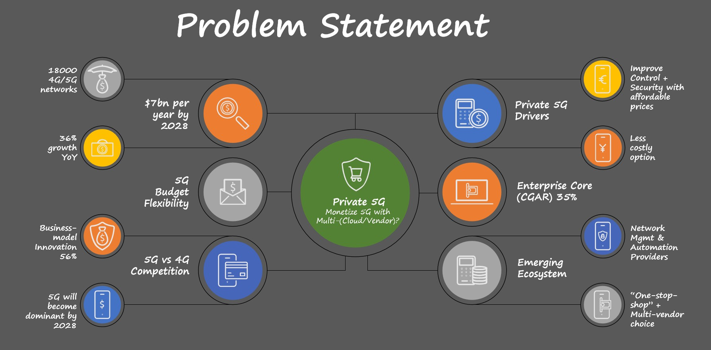
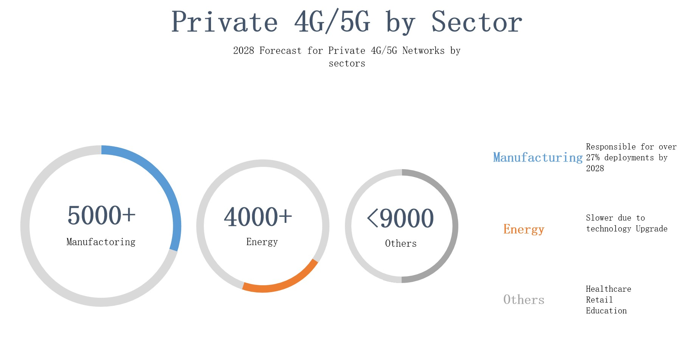
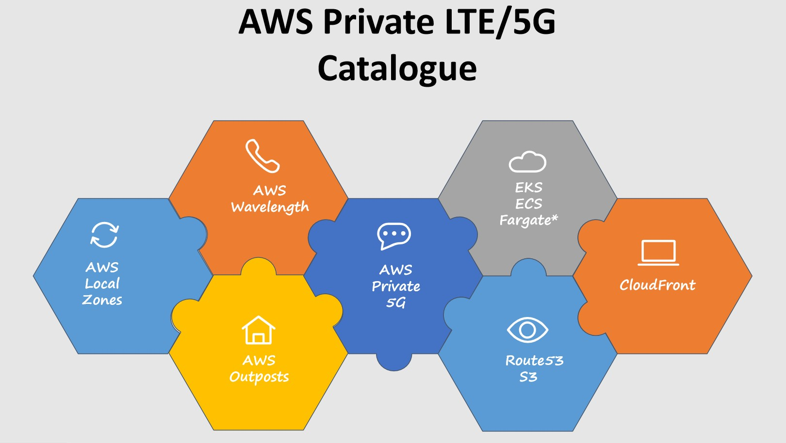

# private5GonAWS
Github Repository for APJ Open Mic August 2024 - Japan Edition on "Private Edge 5G on AWS: Are Multicloud or Multivendor Solutions the Key?"


# Agenda

- [Problem Statement](#problem-statement)
- [Private 5G on AWS](#private-5g-on-aws)
- [Private 5G on EKS](#private-5g-on-eks)
  - [EKS Deployment - CDK](#eks-deployment---cdk)
- [Private 5G on AWS - Red Hat](#private-5g-on-aws---red-hat)
  - [Pre-requisites to create ROSA](#pre-requisites-to-create-rosa)
    - [How to Add OpenShift to Your AWS Account](#how-to-add-openshift-to-your-aws-account)
    - [Install and Configure CLI](#install-and-configure-cli)
  - [ROSA cluster implementation](#rosa-cluster-implementation)
    - [Create Account Roles](#create-account-roles)
    - [Create a ROSA Cluster](#create-a-rosa-cluster)
    - [Monitor ROSA Cluster Creation Process](#monitor-rosa-cluster-creation-process)
    - [Describe ROSA Cluster](#describe-rosa-cluster)
- [Private 5G on EKS Demo](#private-5g-on-eks-demo)
  - [Deployment of NGC and Registration of Subscribers](#deployment-of-ngc-and-registration-of-subscribers)
    - [Step 1: Pull the Helm Charts](#step-1-pull-the-helm-charts)
    - [Step 2: Deploy the NGC (open5gs)](#step-2-deploy-the-ngc-open5gs)
    - [Step 3: Deploy the RAN (srsran-5g-zmq)](#step-3-deploy-the-ran-srsran-5g-zmq)
  - [Verify Deployment](#verify-deployment)
    - [Step 1: Verify Connection between SMF and UPF](#step-1-verify-connection-between-smf-and-upf)
    - [Step 2: Verify Connection between AMF and gNodeB](#step-2-verify-connection-between-amf-and-gnodeb)
    - [Step 3: Verify UE’s Connectivity](#step-3-verify-ues-connectivity)
- [Takeaways](#takeaways)

## Problem Statement

Private LTE/5G Problem statement




Private LTE/5G Sector



## Private 5G on AWS

Private LTE/5G AWS Catalogue Services:


- [AWS Private 5G](https://aws.amazon.com/private5g/)
- [AWS Wavelength](https://aws.amazon.com/wavelength/)
- [AWS Outposts](https://aws.amazon.com/outposts/)
- [AWS Local Zones](https://aws.amazon.com/about-aws/global-infrastructure/localzones/)
- [AWS EKS](https://aws.amazon.com/eks/)
- [AWS ECS](https://aws.amazon.com/ecs/)
- [AWS Fargate](https://aws.amazon.com/fargate/)
- [AWS CloudFront](https://aws.amazon.com/cloudfront/)
- [AWS S3](https://aws.amazon.com/s3/)
- [AWS Route 53](https://aws.amazon.com/route53/)




## Private 5G on EKS

### EKS Deployment - CDK

Here are the steps to initialize a base app using typescript language, then you will install related EKS blueprints

1. Install Node Version Manager (n) `npm install -g n`

2. Install Stable Version of Node.js `n stable`

3. Install AWS CDK `npm install -g aws-cdk@2.147.3`

4. Verify AWS CDK Installation `cdk --version`

5. Initialize sample app with `cdk init app --language typescript`

6. Install the eks-blueprints NPM package `npm i @aws-quickstart/eks-blueprints`

7. Modify Following ts files:

#### bin/my-blueprints.ts Code

```typescript
import * as cdk from 'aws-cdk-lib';
import * as blueprints from '@aws-quickstart/eks-blueprints';

const app = new cdk.App();
const account = 'AWS ACCOUNT';
const region = 'AWS REGION';
const version = 'auto';

blueprints.HelmAddOn.validateHelmVersions = true; // optional if you would like to check for newer versions

// Alternative addOns installation can be done through AWS Console - EKS -> Clusters -> Add-Ons
const addOns: Array<blueprints.ClusterAddOn> = [
    new blueprints.addons.ArgoCDAddOn(),
    new blueprints.addons.MetricsServerAddOn(),
    new blueprints.addons.ClusterAutoScalerAddOn(),
    new blueprints.addons.AwsLoadBalancerControllerAddOn(),
    new blueprints.addons.VpcCniAddOn(), // support network policies ootb
    new blueprints.addons.CoreDnsAddOn(),
    new blueprints.addons.KubeProxyAddOn(),
    new blueprints.addons.AwsEbsCsiDriverAddOn() // Adding EBS CSI Driver support
];

const stack = blueprints.EksBlueprint.builder()
    .account(account)
    .region(region)
    .version(version)
    .addOns(...addOns)
    .useDefaultSecretEncryption(true) // set to false to turn secret encryption off (non-production/demo cases)
    .build(app, 'eks-blueprint');
```
#### lib/my-blueprints-stack.ts Code

```typescript
import * as cdk from 'aws-cdk-lib';
import { Construct } from 'constructs';
// import * as sqs from 'aws-cdk-lib/aws-sqs';

export class MyBlueprintsStack extends cdk.Stack {
  constructor(scope: Construct, id: string, props?: cdk.StackProps) {
    super(scope, id, props);

  }
}
```

8. Bootstrap your environment with the following command: `cdk bootstrap aws://<your-account-number>/<region-to-bootstrap>`

9. If no errors up to this part, proceed with the CDK deploy operation: `cdk deploy`

10. Once the deployment is completed, you will similar output in your terminal:

```Bash
Outputs:
east-test-1.easttest1ClusterName8D8E5E5E = <region>
east-test-1.easttest1ConfigCommand25ABB520 = aws eks update-kubeconfig --name <region> --region <region>--role-arn <ROLE_ARN>
east-test-1.easttest1GetTokenCommand337FE3DD = aws eks get-token --cluster-name <region> --region <region> --role-arn <ROLE_ARN>

Stack ARN:
arn:aws:cloudformation:us-east-1:115717706081:stack/<region>/ARN
```

11. To update your Kubernetes config for you new cluster, execute the `aws eks update-kubeconfig` command show in step 10.

12. Now you should be able to execute kubectl commands and start deploying applications

```Shell
kubectl get nodes
NAME                           STATUS   ROLES    AGE   VERSION
ip-10-0-104-250.ec2.internal   Ready    <none>   11d   v1.29.3-eks-ae9a62a
ip-10-0-187-88.ec2.internal    Ready    <none>   13d   v1.29.3-eks-ae9a62a
```

## Opeshift Cluster on AWS - Red Hat


### Pre-requisites to create ROSA

Before you can create your first ROSA cluster, ensure the following:

- **AWS Account and IAM User**:
  - You need an AWS account with an IAM user.
  - Since you subscribe to ROSA through the AWS Marketplace, your IAM user must have AWS Marketplace permissions. If you lack these permissions, contact your AWS account administrator to grant you access.
  - For more details on troubleshooting ROSA enablement errors, review the documentation in the reference section.

- **AWS Service Quotas**:
  - Your AWS account must have sufficient AWS service quotas to create ROSA clusters.
  - Use the `rosa` command to verify these quotas.
  - Review the documentation in the reference section for a list of required quotas.

- **Red Hat Account**:
  - You need a Red Hat account to access the Hybrid Cloud Console.
  - The cluster creation process links your Red Hat account with your AWS account, allowing you to manage your ROSA clusters from the OpenShift Cluster Manager web interface.

#### How to Add OpenShift to Your AWS Account

Subscribing to ROSA through the AWS Marketplace is straightforward. Follow these steps to enable ROSA in your AWS account:

1. **Log in to the AWS Management Console**:
   - Visit [AWS Management Console](https://console.aws.amazon.com/).

2. **Navigate to the ROSA Service**:
   - Go to **Services** > **Containers** > **Red Hat OpenShift Service on AWS**.

3. **Get Started with ROSA**:
   - Click **Get started** to reach the Verify ROSA prerequisites page.

4. **Check Your Subscription Status**:
   - If you see the "You previously enabled ROSA" checkmark, you are already subscribed.

5. **Enable ROSA (if not already subscribed)**:
   - Select **I agree to share my contact information with Red Hat**.
   - Click **Enable ROSA**.

After following these steps, this should be the final result:


#### Install and Configure CLI

- Install the aws command on your system. The tool is available at https://aws.amazon.com/cli/.

- Run the aws configure command to provide your IAM user credentials and to select your AWS Region.

```
$ aws configure
AWS Access Key ID [None]: [Key]
AWS Secret Access Key [None]: [Secret]
Default region name [None]: us-east-1
Default output format [None]: <Enter>
```
- Download and install the ROSA CLI from [Red Hat OpenShift Downloads](https://console.redhat.com/openshift/downloads).

- Execute the `rosa login` command to log in to your Red Hat account. This command will prompt you to generate an access token.

```
$ rosa login
To login to your Red Hat account, get an offline access token at https://console.redhat.com/openshift/token/rosa
? Copy the token and paste it here:
```

### ROSA cluster implementation

The following steps will explain how to install a ROSA cluster using CLI. UI implementation is also available, but not discussed in this blog.

#### Create Account Roles

To create ROSA clusters, you must first set up specific IAM roles and policies in your AWS account. These roles grant the necessary permissions for the ROSA cluster creation process to create AWS resources, such as EC2 instances.

Steps:
1. Log in to your AWS and Red Hat accounts using `aws configure` and `rosa login` commands.
2. Run `rosa create account-roles` to create the IAM resources.
   - Use `--mode auto` to automate role and policy creation via the AWS API.
   - Add `--yes` to skip confirmation prompts.

Example:

```
$ rosa create account-roles --mode auto --yes
...output omitted...
I: Creating account roles
I: Creating roles using 'arn:aws:iam::...:user/mgonzalez@example.com-fqppg-admin'
I: Created role 'ManagedOpenShift-Installer-Role' ...
I: Created role 'ManagedOpenShift-ControlPlane-Role' ...
I: Created role 'ManagedOpenShift-Worker-Role' ...
I: Created role 'ManagedOpenShift-Support-Role' ...
I: To create a cluster with these roles, run the following command:
rosa create cluster --sts
```
#### Create a ROSA Cluster

Once your cloud environment is prepared, you can create a ROSA cluster.

To do this, open a command-line terminal and run `rosa create cluster`. This command starts the cluster creation process and exits immediately, allowing the installation to proceed unattended on AWS.

By default, `rosa create cluster` runs in interactive mode. You only need to specify the cluster name and can accept the default values suggested for other parameters.

```
$ rosa create cluster
I: Enabling interactive mode
? Cluster name: openshiftmarco
? Deploy cluster using AWS STS: Yes
W: In a future release STS will be the default mode.
W: --sts flag won't be necessary if you wish to use STS.
W: --non-sts/--mint-mode flag will be necessary if you do not wish to use STS.
? OpenShift version: 4.12.14
I: Using arn:...:role/ManagedOpenShift-Installer-Role for the Installer role
I: Using arn:...:role/ManagedOpenShift-ControlPlane-Role for the ControlPlane role
I: Using arn:...:role/ManagedOpenShift-Worker-Role for the Worker role
I: Using arn:...:role/ManagedOpenShift-Support-Role for the Support role
? External ID (optional): <Enter>
? Operator roles prefix: openshiftmarco-p5k3  1
? Multiple availability zones (optional): No
? AWS region: us-east-1
? PrivateLink cluster (optional): No
...output omitted...
I: Creating cluster 'openshiftmarco'
I: To create this cluster again in the future, you can run:  2
   rosa create cluster --cluster-name openshiftmarco --sts --role-arn arn:aws:iam::452954386616:role/ManagedOpenShift-Installer-Role --support-role-arn arn:aws:iam::452954386616:role/ManagedOpenShift-Support-Role --controlplane-iam-role arn:aws:iam::452954386616:role/ManagedOpenShift-ControlPlane-Role --worker-iam-role arn:aws:iam::452954386616:role/ManagedOpenShift-Worker-Role --operator-roles-prefix openshiftmarco-p5k3 --region us-east-1 --version 4.12.14 --compute-nodes 2 --compute-machine-type m5.xlarge --machine-cidr 10.0.0.0/16 --service-cidr 172.30.0.0/16 --pod-cidr 10.128.0.0/14 --host-prefix 23
I: To view a list of clusters and their status, run 'rosa list clusters'
I: Cluster 'openshiftmarco' has been created.
I: Once the cluster is installed you will need to add an Identity Provider before you can login into the cluster. See 'rosa create idp --help' for more information.
...output omitted...
I: Run the following commands to continue the cluster creation:  3

	rosa create operator-roles --cluster openshiftmarco
	rosa create oidc-provider --cluster openshiftmarco

I: To determine when your cluster is Ready, run 'rosa describe cluster -c openshiftmarco'.
I: To watch your cluster installation logs, run 'rosa logs install -c openshiftmarco --watch'.
```

A simplified, and more direct way to deploy a specific Red Hat Openshift cluster, defining above items + EC2 size will be:

`rosa create cluster --cluster-name openshiftmarco --region us-east-1 --multi-az=false --compute-machine-type m5.2xlarge --replicas 2 --sts --mode auto`

#### Monitor ROSA Cluster Creation Process

The `rosa describe cluster --cluster [cluster_name]` will show the deployment status.

```
$ rosa describe cluster --cluster mycluster
...output omitted...
State:      installing
...output omitted...
```

```
$ rosa describe cluster --cluster mycluster
...output omitted...
State:      ready
...output omitted...
```

#### Describe ROSA Cluster

Use the `rosa describe cluster -c [cluster_name]` to describe the cluster information.

```
>rosa describe cluster -c openshiftmarco
WARN: The current version (1.2.39) is not up to date with latest released version (1.2.40).
WARN: It is recommended that you update to the latest version.
 
Name:                   	openshiftmarco
Domain Prefix:          	openshiftmarco
Display Name:           	openshiftmarco
ID:                         2bqn7jb8ts39iushkqantla77o3ic1sl
External ID:
Control Plane:          	Customer Hosted
OpenShift Version:
Channel Group:          	stable
DNS:                    	Not ready
AWS Account:            	615956341945
API URL:
Console URL:
Region:                 	us-east-1
Multi-AZ:               	false
 
Nodes:
 - Control plane:       	3
 - Infra:               	2
 - Compute:             	2
Network:
 - Type:                	OVNKubernetes
 - Service CIDR:        	172.30.0.0/16
 - Machine CIDR:        	10.0.0.0/16
 - Pod CIDR:            	10.128.0.0/14
 - Host Prefix:         	/23
EC2 Metadata Http Tokens:   optional
Role (STS) ARN:             arn:aws:iam::615956341945:role/ManagedOpenShift-Installer-Role
Support Role ARN:           arn:aws:iam::615956341945:role/ManagedOpenShift-Support-Role
Instance IAM Roles:
 - Control plane:           arn:aws:iam::615956341945:role/ManagedOpenShift-ControlPlane-Role
 - Worker:                  arn:aws:iam::615956341945:role/ManagedOpenShift-Worker-Role
Operator IAM Roles:
 - arn:aws:iam::615956341945:role/openshiftmarco-t2j5-openshift-cloud-network-config-controller-cl
 - arn:aws:iam::615956341945:role/openshiftmarco-t2j5-openshift-machine-api-aws-cloud-credentials
 - arn:aws:iam::615956341945:role/openshiftmarco-t2j5-openshift-cloud-credential-operator-cloud-cr
 - arn:aws:iam::615956341945:role/openshiftmarco-t2j5-openshift-image-registry-installer-cloud-cre
 - arn:aws:iam::615956341945:role/openshiftmarco-t2j5-openshift-ingress-operator-cloud-credentials
 - arn:aws:iam::615956341945:role/openshiftmarco-t2j5-openshift-cluster-csi-drivers-ebs-cloud-cred
Managed Policies:       	No
State:                  	waiting (OIDC Provider not found: operation error STS: AssumeRoleWithWebIdentity, https response error StatusCode: 400, RequestID: 0956a1b9-92dd-4270-b654-4143dc650624, InvalidIdentityToken: No OpenIDConnect provider found in your account for https://oidc.op1.openshiftapps.com/2bqn7jb8ts39iushkqantla77o3ic1sl)
Private:                	No
Delete Protection:      	Disabled
Created:                	Jun 11 2024 03:17:42 UTC
User Workload Monitoring:   Enabled
Details Page:           	https://[URL]
OIDC Endpoint URL:      	https://[URL] (Classic)
```

```
>rosa create admin --cluster=openshiftmarco
WARN: The current version (1.2.39) is not up to date with latest released version (1.2.40).
WARN: It is recommended that you update to the latest version.
INFO: Admin account has been added to cluster 'openshiftmarco'.
INFO: Please securely store this generated password. If you lose this password you can delete and recreate the cluster admin user.
INFO: To login, run the following command:
 
   oc login https://api.openshiftmarco.b3b3.p1.openshiftapps.com:6443 --username cluster-admin --password 3HgZ3-wN495-RLc3v-7sLaU
 
INFO: It may take several minutes for this access to become active.
```

## Private 5G on EKS Demo

Once the Kubernetes cluster is deployed (either through EKS or ROSA), we can proceed with the 5G application installation:

# Deployment of NGC and Registration of Subscribers

1. To pull the Helm charts for `open5gs` and `srsran-5g-zmq` from the OCI registry, use the following commands:

```sh
helm pull oci://registry-1.docker.io/gradiant/open5gs --version 2.2.0
helm pull oci://registry-1.docker.io/gradiant/srsran-5g-zmq --version 1.0.0
```
2. Deployment of NGC and Registration of Subscribers

To deploy the NGC (Next Generation Core) and register subscribers, follow these steps:

### Step 1: Deploy the NGC (open5gs)

Use the following Helm command to install the `open5gs` chart. This deployment uses a specific values file provided by Gradiant.

```sh
helm install open5gs oci://registry-1.docker.io/gradiant/open5gs --version 2.2.0 --values https://gradiant.github.io/5g-charts/docs/open5gs-srsran-5g-zmq/ngc-values.yaml
```

### Step 2:  Deploy the RAN (srsran-5g-zmq)
```sh
helm install srsran-5g-zmq oci://registry-1.docker.io/gradiant/srsran-5g-zmq --version 1.0.0
```

# Verify Deployment

After deploying the NGC and RAN, follow these steps to verify the deployment and ensure proper connectivity:

### Step 1: Verify Connection between SMF and UPF (C-Plane and U-Plane of NGC)

Check that the SMF (Session Management Function) gets associated with the UPF’s (User Plane Function) address:

```sh
kubectl logs deployment/open5gs-smf -f
```

### Step 2: Verify Connection between AMF and gNodeB

Check that the AMF (Access and Mobility Management Function) accepts and adds the gNodeB:

```sh
kubectl logs deployment/open5gs-amf -f
```

### Step3: Step 3: Verify UE’s Connectivity


## Takeaways

